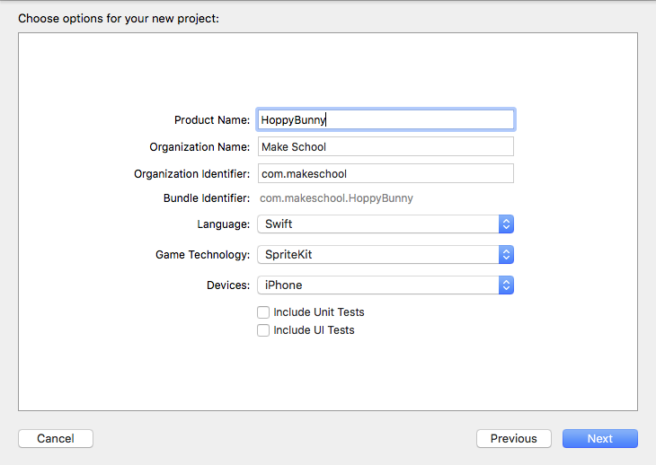
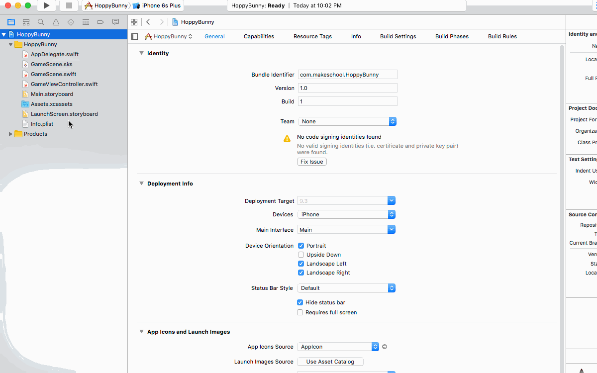
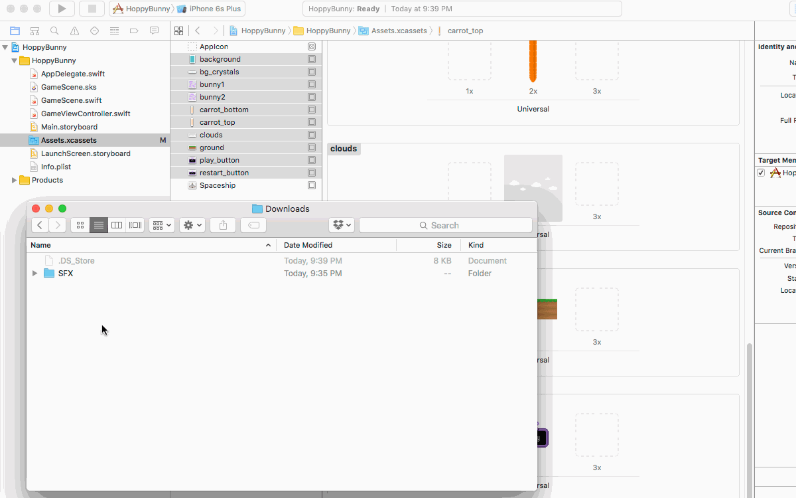

If you have never built a side scroller before, this introduction will help you understand the basic concepts. You will be tackling this by constructing an obstacle treadmill.  The player effectively runs on the spot and must navigate the obstacles coming towards them by moving up or down.

You will learn to implement:

- A physics controlled bunny
- Dynamic obstacle object generation and removal
- Animation and actions
- World scrolling
- Implement physics based collision detection
- Your own custom button class

#Create a new project

Time to get started and make a new SpriteKit project in Xcode and get started with Hoppy Bunny!

> [action]
> Your first step is to create a new SpriteKit Xcode project, open Xcode and select `Create a new Xcode project`. Then select `iOS > Application > Game` as shown below:
>
> 
>
1. Enter `HoppyBunny` for `Product Name`.
1. For `Organization Name` you can enter your name, your fake company name, or `Make School`
1. For `Organization Identifier`, you use a reverse domain name style base for your apps. If you own `supercoolsecretstudios.com` you would put `com.supercoolsecretstudios`. If you don't own a domain name, feel free to put `com.makeschool` for this project.
1. Select `Swift` as the `Language`
1. Select `SpriteKit` (not `SceneKit`!) as the `Game Technology`
1. Select `iPhone` as the `Devices`
1. Leave `Include Unit Tests` and `Include UI Tests` unchecked
>
> 

##Adding artwork

> [action]
>
1. After the project is created, you should [Download the Art Pack](https://github.com/MakeSchool-Tutorials/Hoppy-Bunny-SpriteKit-Swift/raw/master/assets.zip).
1. Add the art pack you just downloaded to your Xcode project by first unpacking the archive.
1. Select the `Assets.xcassets` folder in Xcode project navigator
1. Delete the `Spaceship` asset by clicking on it and pressing `delete` on your keyboard
1. Drag the downloaded assets into Xcode
>
> 

##Adding Sound Effects

> [action]
> Download the [SFX Pack](https://github.com/MakeSchool-Tutorials/Hoppy-Bunny-SpriteKit-Swift/raw/master/SFX.zip) we created for you. Once the download is complete, unzip the folder and add
it to the project by dragging the entire unzipped folder into Xcode like this: 

##Asset Scale

This would be good time to touch on the subject of asset scale. You may have noticed when you select an asset in **Assets.xcassets** you are presented with *1x 2x 3x Scale* options.  The assets you added have the `@2x` suffix so they are designed for 2x retina use.

Have a look at this handy [Device resolution guide](http://www.paintcodeapp.com/news/ultimate-guide-to-iphone-resolutions)

#Summary
Great, you've setup a basic project and added the artwork. In the next section it's time to start building our game.
