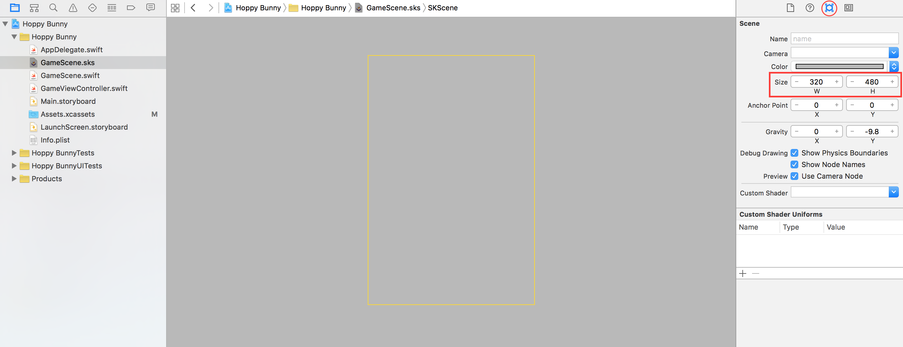
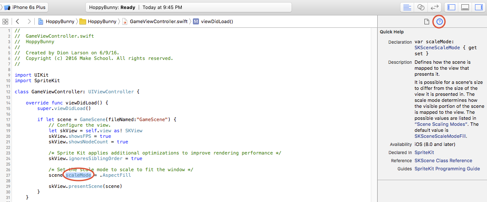

Let's get started setting up the main game scene. We'll be using SpriteKit Scene Editor, which is a powerful tool built into XCode that allows you to visually lay out the scene.

#Setting the stage

> [action]
> Select *GameScene.sks* from the *Project navigator*:
>
> Delete any default objects by clicking to select them and then pressing delete on the keyboard. 
>
> It's helpful to see the entire scene size, so zoom out so you can see the yellow border which represents the scene size. Select `Editor / Zoom Out` or use the keyboard shortcut (**⌘-**). Pinch-to-zoom works too.
>
> Next modify the size parameters as shown in the *Attributes inspector panel.* Set the scene's width to _320_ and height to _568_.
> 

Remember the device resolution guide in the previous chapter? For this game, we're going to be using a common design size of 320 x 568, which gives us a nice portrait view, and is a good size for the artwork.

> [info]
> You may be wondering: what about supporting other devices? Thankfully SpriteKit has your back and can automatically scale the view to fit other device resolutions.
> 
> Have a look through the code in *GameViewController.swift*.  In particular:
>
```
/* Set the scale mode to scale to fit the window */
>
scene.scaleMode = .aspectFill
```
>
> If you `highlight` *scaleMode* and look at the *Quick Help inspector* panel you can find out more about the scaling options available. 
>
Alternatively, you can hold `option` and click on `scaleMode`. Both of these features will help you get a better understanding of code throughout all your projects in Xcode!

##Add the background

> [action]
> Select *Show the media library* in the *Library pane*, add the background image by dragging *background.png* onto the stage:
>
> 
>
> You'll want to center the background on the screen. You can do this by setting the *Position* to `(x = 0, y = 0)`
>
> When you add an object to the game scene by dragging it from the library like we did, a *Color Sprite* object is created and the texture property is pre-populated with the texture name of the asset you dragged in.

<!--  -->

> [info]
> By default when you move an object it will use the handy snapping feature. Sometimes you don't want this behavior: you can *Hold down shift* while dragging an object to disable snapping.

##Add the ground image

> [action]
> Scroll through the media library and drag *ground.png* into the scene.
> Set the position to `(0, -257)` or anywhere you think looks good; it is your game after all!
>
> 
>

You'll notice the ground image extends beyond the screen border. Don't worry about that, the user won't be able to tell. Later, we will be scrolling the ground right-to-left to create that endless runner effect.

##Add the clouds

> [action]
> Drag in *clouds.png* to the scene
> Set the *Position* to `(0, 194)` or any other value you think looks good.
>
> 
>

#Creating the Bunny Scene

Now we're going to create a new *SpriteKit Scene File* for the bunny. We're going to be giving the bunny some animations, and the way SpriteKit works, each individually animated object needs its own scene.

> [action]
> Create a new *SpriteKit Scene File* by selecting `File > New > File > iOS > Resource > SpriteKit Scene`:
>
> 
>
> Because bunnies are heroes, save the file as `Hero.sks`
>
> 

##Add the bunny

> [action]
>
> Select *Hero.sks* in the *Project navigator*
>
> Drag *bunny1.png* into scene:
>
> You may not be able to see the bunny, if not `Zoom Out` the scene, center your view on the bunny and `Zoom In` a little.
>
> We will be connecting the bunny to our code later so we'll need a way to reference it from code. This is typically done using the *Name* property, so set *Name* to `hero`. While you're at it, set the bunny's position to `(0, 0)`. 
>
> 
>

<!--  -->

> [info]
> By default, new SpriteKit scenes have a size of 1024 x 768. Personally I dislike using this huge default scene size, particularly when only dealing with a single asset. It can also cause unexpected position issues later on when using the scene as a referenced object.

<!-- html comment to break boxes -->

> [action]
> Click anywhere other than the bunny itself and set the scene *Size* (as you previously did with the *GameScene*) to `(33, 33)`.  Why `(33, 33)`? This is the *Size* of the *bunny* sprite.
> Set the *Anchor Point* to `(0.5, 0.5)`

##Animating the bunny

Great, you have a static bunny.  However, we want this bunny to fly - why not make it fly by flapping it's ears? You are going to set up a sprite frame based animation, which will be ~`0.5` seconds long and repeat forever. Sprite frame based animations work by swapping the image (sprite) being displayed - in this case we have two frames in which the bunny's ears move, and we can swap between these frames to make an animation.

> [action]
> Open *Hero.sks*, select the *Object library* panel and look for the *AnimateWithTextures Action*. Drag this onto the start of the bunny *Timeline* as shown:
>
> 
>
> Set the *Duration* to `0.5`.
>
> Time to add the animation frames, click on the *AnimateWithTextures Action* in the *Timeline* then click on the *Media library* panel.
> Drag *bunny1.png* and *bunny2.png* into the *Textures* box as shown:
>
> 
>
> Before we try viewing the animation, let's make it loop. Click on the *Circular arrow* in the bottom left of your *AnimateWithTextures Action* as shown and click the *Infinity symbol*.
>
> 
>
> 
>
> Finally time to see the bunny in action! Click *Animate* in the *Timeline* and watch that bunny go.
>
> 
>

#Summary

The game is already starting to take shape! In this step, you learned how to:

- Build the layout for your game scene using the SpriteKit Scene Editor.
- Create the hero of the game as a stand-alone SpriteKit Scene
- Use some of the basic parts of the timeline and add your first action
- Added a sprite frame animation to bring the bunny to life

In the next chapter we will be adding some physics to the game world.
