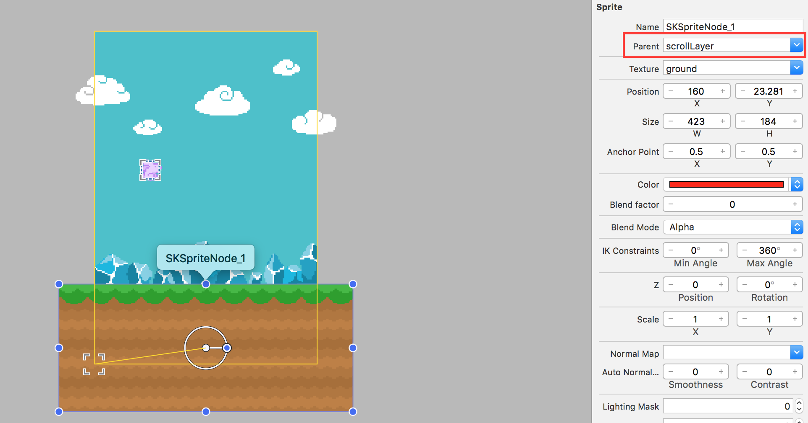

Time for us to bring this world to life: we will be creating a conveyor belt system to scroll the world objects toward the player, giving an illusion of the player moving.


#Ready to rock and scroll

To control the speed of this conveyor belt you will want to add a new *scrollSpeed* property to the *GameScene* class.

> [action]
> Add the following line to *GameScene.swift* after the *fixedDelta* property:
>
```
let scrollSpeed: CGFloat = 160
```
>

##Virtual scroll layer

We will need to use this property to manipulate the scroll speed of the conveyor belt, before we do this we need to modify the *GameScene* to create a virtual layer for all the objects we wish to scroll.  

> [action]
> Drag an *Empty* node to the scene, set the position to `(0,0)`, set *Z-Position* to `2` and set the *Name* to `scrollLayer`:
>
> 
>

Next we need to create a code connection for the *scrollLayer*

> [action]
> Open *GameScene.swift* and add the following after the `hero` property declaration.
>
```
var scrollLayer: SKNode!
```
>

Next we need to create the code connection to the Scene Editor object. This step is very similar to creating the *hero* code connection, although this time there is no need to do a recursive node search as this node sits directly below the *GameScene*.

> Add the following after the *hero* node connection code.
>
```
/* Set reference to scroll layer node */
scrollLayer = self.childNodeWithName("scrollLayer")
```
>

#Scroll World
In order to help keep the code organized, let's do the scrolling work in a new method called **scrollWorld**. We'll end up calling this method from the existing `update(...)` method.

> [action]
> Add the following method at the end of the *GameScene* class (but before the last closing bracket):
>
```
func scrollWorld() {
  /* Scroll World */
  scrollLayer.position.x -= scrollSpeed * CGFloat(fixedDelta)
}
```
>
> Then add the following to the bottom of your `update(...)` method:
>
```swift
/* Process world scrolling */
scrollWorld()
```

<!-- -->

> [info]
> Defining an instance variable (`scrollSpeed`) for the scroll speed rather than simply hardcoding the hero's position to be increased by `160` * *delta* every time is an important programming practice.  Variable names offer us clarity - if someone else looks at your code, or even if you revisit it next week, it may not be clear what `160` affects.
> Explicitly using the variable `scrollSpeed` alleviates this problem. It also offers us flexibility. Imagine we were writing a larger program which used `scrollSpeed` in several places and instead of using a variable, we used `160` every time. What happens if we decide our scroll speed is a little slow? We will need to visit every place we wrote `160` and change it. It's not hard to understand how this could quickly get messy and inefficient.

<!-- html comment to break boxes -->

> [action]
Okay, let's test it! Run the game!

#Adding objects to scroll

Oh, no scrolling?  Now that we have a virtual conveyor belt system, we need to put some objects on it :]

> [action]
> Open *GameScene.sks*, select the *ground* node in the scene editor and set the *Parent* value to `scrollLayer`. This modifies the hierarchy of the scene graph.  The *ground* node is now a child of the *scrollLayer* and thus any scrolling applied to the *scrollLayer* will affect the ground node.
>
> 
>

Run the game. The ground should be scrolling, keep watching...

> 

*Note: the crystals look weird in the image above due to color range compression. Yours will look different.*

##Loop the ground

Argh! Eventually you will run out of ground and the bunny will fall into the endless abyss of despair.

We can make the ground actually loop by adding a second ground sprite and implementing an endless scrolling technique using both ground sprites. When a ground sprite leaves the left edge we'll move it back to the right edge of the screen to make the ground look as if it's endlessly repeating.

The first step will be adding a second ground sprite to the *GameScene.sks*

> [action]
> Duplicate the existing *ground* by `Edit -> Copy` then `Edit -> Paste`. This way all the properties of ground are already setup.
> You should snap it to the end of the first ground piece.
>
> 

Run the game.

The ground will now scroll both grounds and so it will take a bit longer for the bunny to fall into the abyss. The power of this setup is you can simply add new objects to the *scrollLayer* and they will scroll. However, we want to ensure our ground sprites will loop forever; this is an infinite flapper after all.

In the update method, we will perform a check against every ground object in the *scrollLayer* to see if it has moved outside of the left edge of the screen, if it has, we will relocate it to back to the right edge.

> [action]
> Add the following code to the end of the `scrollWorld()` method:
>
```
/* Loop through scroll layer nodes */
for ground in scrollLayer.children as! [SKSpriteNode] {
>
  /* Get ground node position, convert node position to scene space */
  let groundPosition = scrollLayer.convertPoint(ground.position, toNode: self)
>
  /* Check if ground sprite has left the scene */
  if groundPosition.x <= -ground.size.width / 2 {
>
      /* Reposition ground sprite to the second starting position */
      let newPosition = CGPointMake( (self.size.width / 2) + ground.size.width, groundPosition.y)
>
      /* Convert new node position back to scroll layer space */
      ground.position = self.convertPoint(newPosition, toNode: scrollLayer)
  }
}
```
>

##Relative node position

This code retrieves the current screen position for each ground sprite. Since the ground sprites aren't children of the *GameScene*, we need to convert their relative position inside the *scrollLayer* to *GameScene* coordinate space using the `convertPoint(...)` method.

Once we have this world space position, we check if the ground sprite is outside of the the screen. If so then move it to the right edge of the screen. We calculate the new position for the node in *GameScene* (world space) and then convert this back to get the relative position in *scrollLayer* space.

This creates the ground's endless repeating effect.

> [action]
> Run the game. The ground should now scroll for eternity. This particular fact will be hard to test :]

#Summary

The game now has a sense of movement, and you have learned:

- To create an endless scrolling mechanic
- Convert object positions between different node spaces

In the next chapter it's time to add some challenge to the game with obstacles.
