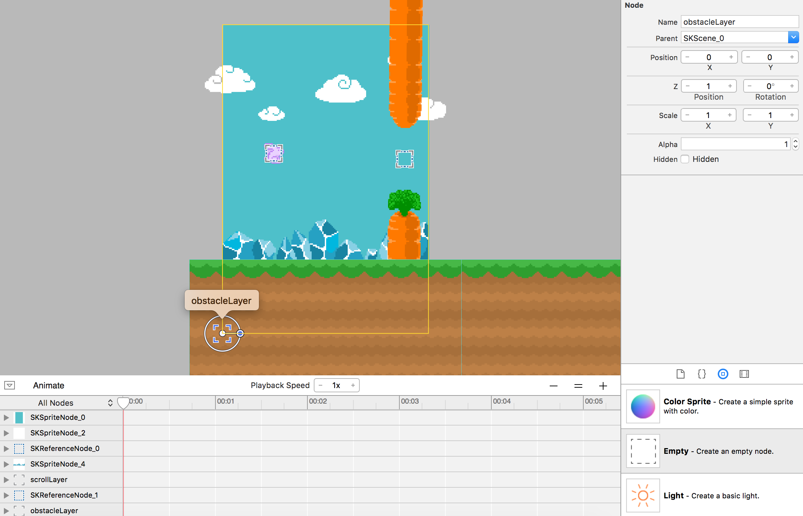

Let's create obstacles for the player to navigate, and implement a mechanic to randomize their position to make the game more challenging.

#Creating the obstacle

> [action]
> Create a new *SpriteKit Scene File* by selecting `File > New > File > SpriteKit Scene`:
>
> 
> Save the file as *Obstacle.sks*
>
> 

We will be constructing the obstacles with two carrots, one at the top and one at the bottom of the screen. We will also include a special invisible *Color Sprite* between the carrots, which we will use to detect when the player has passed between the carrots, so that we may increase their score.

> [action]
> Modify the size and anchor point of this new obstacle scene properties as shown:
> 
> Set the *Anchor Point* to `(0.5, 0.5)` and *Size* to `(51, 768)`.
>
> Drag *carrot_top.png* and *carrot_bottom.png* from your *Media Library*, and snap the carrots in place. The bottom carrot should be at position `(0, -216)` an the top carrot at position `(0, 216)`.
> Next add a *Color Sprite* from the object library and position it in between the carrots as shown, with size `(51, 100)` and position `(0, 2)`.
> Set the *Name* to `goal`
>
> 
>
> We want to change the color value of the sprite to be transparent as we don't want the player to be able to see it. It will act as an invisible sensor or trigger, for when the bunny moves through it. This will be discussed in more detail in the next chapter.
>
> Your final obstacle should look something like this:
>
> 
>

<!-- -->

> [info]
> So how did I know that the obstacle scene should be exactly `51` pixels wide and `768` tall? Well, sometimes you just need to play around in the visual editor and then adjust. In this case, I saw the carrots had a width of `51`, so I used that value.
> The default height of `768` (iPhone 5) was no coincidence, as the assets were designed to fill an iPhone 5 screen height, leaving a suitable `100` pixel gap for the player to pass through.

<!-- -->

##Adding an obstacle

You can test if you've setup the obstacle correctly by adding it to the *GameScene*.

> [action]
> Open *GameScene.sks* and drag *Obstace.sks* into the scene, if you don't see anything, do a quick *Save* to refresh SpriteKit.

You may have probably noticed the obstacle is sitting behind the crystals. We will want it to sit in front of the crystals, but sit behind the ground.  

> [action]
> If you have this problem, can you fix it? Remember we ran into similar *Z-Position* issues when we set up the scene initially.

> [solution]
> Tweak the *scrollLayer* which contains the ground nodes, set *Z-Position* to `2` and set the *Obstacle* reference node *Z-position* to `1`.

Now your scene will hopefully look a lot like this.


#Dynamic obstacle generation

Now it's time to learn about dynamic obstacle generation, or _DOG_ for short. Of course, we could design a huge level if we wanted to, and in it we could manually place each obstacle. However, for an infinite runner this just isn't practical.

##Obstacle layer

It would be useful to add another virtual layer to contain the obstacles.

> [action]
> Open *GameScene.sks* open and drag an *Empty* node into the scene.
> Set the position to `(0, 0)`, *Z-Position* to `1` and *Name* to `obstacleLayer`
>
> 
>
> Next, set the obstacle reference node's parent to *ObstacleLayer*:
> 

<!-- -->

> [info]
> It can sometimes be tricky to select nodes in the editor when they are on top of each other. To work around this problem you can use the scene hierarchy selector at the top:
>
> 

##Connecting the obstacle layer

We need some code so that we can reference the obstacle layer in the game's logic.

> [action]
> Open *GameScene.swift*
> Add the following property to the *GameScene* class:
>
```
var obstacleLayer: SKNode!
```
>
> Add the following code after we set up the *Scroll Layer* connection:
>
```
/* Set reference to obstacle layer node */
obstacleLayer = self.childNodeWithName("obstacleLayer")
```

##Spawn Timer

We'll add a timer property to help us manage the rate of obstacle generation. If it's too slow, it'll be boring, but if it's too fast it'll be too hard.

> Add the following after the *sinceTouch* property declaration:
>
```
var spawnTimer: CFTimeInterval = 0
```
>

#Obstacle scrolling

We are going to create another conveyor belt style solution for the newly added *ObstacleLayer*.

> [action]
> Open *GameScene.swift* and add the following method to the *GameScene* class:
>
```
func updateObstacles() {
   /* Update Obstacles */
>
   obstacleLayer.position.x -= scrollSpeed * CGFloat(fixedDelta)
>
   /* Loop through obstacle layer nodes */
   for obstacle in obstacleLayer.children as! [SKReferenceNode] {
>
       /* Get obstacle node position, convert node position to scene space */
       let obstaclePosition = obstacleLayer.convertPoint(obstacle.position, toNode: self)
>
       /* Check if obstacle has left the scene */
       if obstaclePosition.x <= 0 {
>
           /* Remove obstacle node from obstacle layer */
           obstacle.removeFromParent()
       }
>
   }
>
 }
 ```

This code should look somewhat similar to the `scrollWorld()` method. Unlike the ground in `scrollWorld()`, when an obstacle has left the scene, there is no longer any need for it, so we remove it with the `removeFromParent()` method.

> [action]
> Can you modify your game code to call the `updateObstacles()` method once every frame?

<!-- html comment to break boxes -->

> [solution]
> As with the `scrollWorld()` method, add the following to the `update(...)` method, after the `scrollWorld()` method.
>
```
/* Process obstacles */
updateObstacles()
```

Run the game! You should see the first obstacle scroll past, but sadly our conveyor only has one obstacle. Let's make it a bit more challenging.

#Spawning endless randomized obstacles

The next task will be to continuously spawn obstacles until the end of time.

We will implement a mechanic that spawns a new obstacle based on a timer. Feel free to play around with the timer and really challenge the player.

> [action]
> Add this code to the end of the *updateObstacles* method:
>
```
/* Time to add a new obstacle? */
if spawnTimer >= 1.5 {
>
    /* Create a new obstacle reference object using our obstacle resource */
    let resourcePath = NSBundle.mainBundle().pathForResource("Obstacle", ofType: "sks")
    let newObstacle = SKReferenceNode (URL: NSURL (fileURLWithPath: resourcePath!))
    obstacleLayer.addChild(newObstacle)
>
    /* Generate new obstacle position, start just outside screen and with a random y value */
    let randomPosition = CGPointMake(352, CGFloat.random(min: 234, max: 382))
>
    /* Convert new node position back to obstacle layer space */
    newObstacle.position = self.convertPoint(randomPosition, toNode: obstacleLayer)
>
    // Reset spawn timer
    spawnTimer = 0
}
```

In the code above, a new obstacle instance is created from our *Obstacle.sks* every `1.5` seconds. It is then moved just out of view and the **Y Position** is randomly set between the **min** value of `234` and a **max** value of `382` to mix things up a little.

When deciding these sorts of gameplay values, it's handy to go back to *GameScene.sks* and check the **Y Position** of our obstacle.  Move it up and down and take note of the Y Position, then pick a range that looks good to you.
Once you are finished set your obstacle just outside of the scene view, this will be the first obstacle the player sees.

> [info]
> You know that feeling when you play a great game and the core mechanic feels just right? This is rarely a coincidence; expect to tweak game values and tinker with mechanics. Get friends to give feedback until the balance feels right.

Although we've added the `spawnTimer` property, we have a problem. It hasn't yet been set up to track time. It will just stay at the initial value of `0` the whole game. 

> [action]
Try to fix your code, so `spawnTimer`'s value increases as the game runs.

<!-- html comment to break boxes -->

> [solution]
> The trick is to add some time to the timer every time the `update(...)` method is called. In this case, we're using a `fixedDelta`, which is to say that we're assuming that time between every frame is the same. Add the following line to the end of the `update(...)` method:
>
```
spawnTimer += fixedDelta
```

Now run the game! You should see obstacles being generated every `1.5` seconds and with varying vertical positions! We're getting closer to completing *Hoppy Bunny*!

#Summary

The game is really coming together now, you've learned to:

- Build a multi-object obstacle
- Dynamically generate obstacles in the scene
- Randomize obstacle properties
- Remove objects from a scene when they are no longer required

In the next chapter we're going to implement physics based collision detection.
